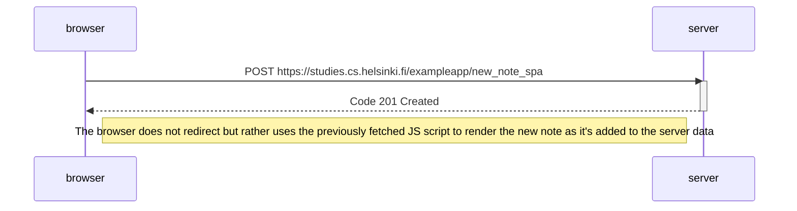

```mermaid
sequenceDiagram
    participant browser
    participant server

    browser->>server: POST https://studies.cs.helsinki.fi/exampleapp/new_note_spa
    activate server
    server-->>browser: Code 201 Created
    deactivate server


    Note right of browser: The browser does not redirect but rather uses the previously fetched JS script to render the new note as it's added to the server data
```
